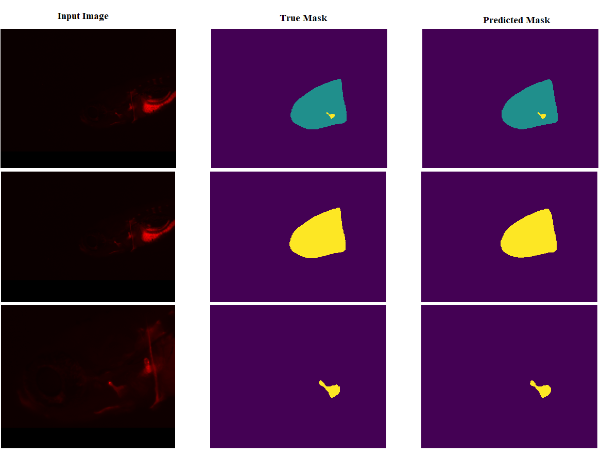

# zebrafish_image_segmentation

**Description:**
A Deep Learning application module for Head & Operculum Segmentation in Zebrafish Microscopy Images

**Paper Link**

DOI: [19th CAIP 2021 Conference](https://doi.org/10.1007/978-3-030-89128-2 15)). <br>

**Abstract (short)**

This repository contains code and documentation related to developing and evaluating deep learning models for segmenting the head and operculum regions of zebrafish larvae in microscopy images. The methods are based on a modified U-Net architecture and include multiple training strategies to address class imbalance.

**_Repository Info_**
- Test Images folder contains the test images, you may use 
- Models folder contains the trained models directly used for testing
- Model architecture is defined in unet_modified.py in src folder
- Main file is run.py in src folder
- All the supporting functions are written in src/utils.py
- Custom _loss functions_ used in the models are written in src/loss_functions.py for **compiling the model**
- Code is compatible with the open-source tool Cytomine ULiège R&D version (https://uliege.cytomine.org)

  **Features**

  -Implementation of two types of segmentation strategies:
    - Three class segmentation approach
    - Two step binary class segmentation approach (head-background segmentation -> Head (object) detection -> Operculum-background segmenation)

**Dataset:**

- Zebrafish lavae (6 dpf) as model fish species
- 8 bit red channel flourescence microscopy images with 1376 x 1032 resolution
- 2293 images collected over 28 experiments with 5 different compounds

**Methodology:**

- CNN Architecture: Modified UNet
- Loss functions: Dice Loss, Tversky Loss, Jaccard Loss, Focal Loss for handling class imbalance and Cross Entropy Loss as baseline

**Test Predictions**

<p align="center"> <br> <em>Figure 1: Example test prediction</em> </p> <br>

**_Reference_**
- Deep Learning appraoches for Head and Operculum Segmentation in Zebrafish Microscopy Images, Navdeep Kumar et. al. In the 19th International Conference on Computer Analysis of Images and Patterns (CAIP-2021)

**Citation:**
```bibtex
@inproceedings{kumar2021deep,
  title={Deep Learning Approaches for Head and Operculum Segmentation in Zebrafish Microscopy Images},
  author={Kumar, Navdeep and Carletti, Alessio and Gavaia, Paulo J and Muller, Marc and Cancela, M Leonor and Geurts, Pierre and Mar{\'e}e, Rapha{\"e}l},
  booktitle={International Conference on Computer Analysis of Images and Patterns},
  pages={154--164},
  year={2021},
  organization={Springer}
}
